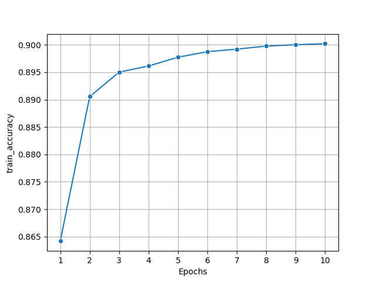
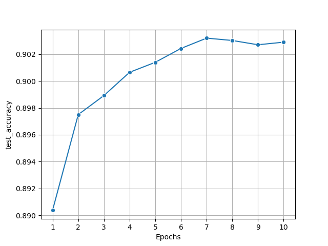

# Protein-dssp-Prediction-Model
A PyTorch LSTM model to predict dssp8 sequences for proteins using their amino acid sequences. 

The DSSP8 classification scheme assigns each residue one of 8 structural states. Accurate prediction of these states from sequence alone is an important step towards understanding protein structure and function.

The current tokenization pipeline uses hugging face tokenizers library with truncation and padding at sequence length of 1000 Amino acids. the model is a bidirectional LSTM model with 2 layers and the embedding dimension of 8. 

## Approach

**Model**: Bidirectional LSTM network with embedding and fully connected layers. 

**Input**: Encoded amino acid sequences.

**Output**: Sequence of DSSP8 predictions (Q8 classification).

**Training**: Cross-entropy loss, Adam optimizer.

**Evaluation**: Accuracy scoring on held out testing dataset. 

## Training and Testing Performance
The model achieved over 90% accuracy on both training and testing datasets with consecutive reduciton in cross entropy loss. The plots are shown below: 

### Train accuracy

### Test accuracy 
